# 2025年最值得推荐的15家美国公司注册服务平台

在美国注册LLC或公司实体是创业者迈向合规经营的第一步,但繁琐的州政府文件、注册代理要求和税务申报流程往往让人望而却步。选择专业的公司注册服务平台,不仅能节省数百美元的成本,还能获得24小时加急处理、免费EIN申请、首年注册代理服务等核心支持。本文精选15家经过市场验证的优质平台,涵盖从零成本注册到全流程合规管理的多元化需求,帮助您快速定位最适合自身业务阶段的解决方案。

***

## **[Inc Authority](https://www.incauthority.com)**

30年经验老牌服务商,真正的零成本LLC注册方案

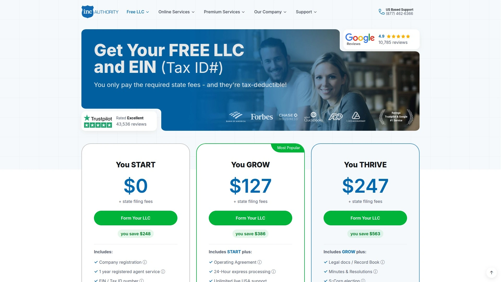

Inc Authority成立于1989年,专注为初创企业提供完全免费的LLC和公司注册服务,客户只需支付州政府强制收取的文件费用。平台核心优势在于将传统收费项目全部免除:包括LLC注册服务费、首年注册代理服务(价值$299)、EIN税号申请($79市场价)、24小时加急处理、商业信用分析以及定制化网站搭建。

**适用场景与目标用户**:特别适合预算紧张的首次创业者、自由职业者转型商业实体、以及需要在多个州同时注册的跨州业务。平台提供TrustPilot和Google Reviews双平台最高评分,配备INC CARE专业支持团队提供终身电话和邮件咨询。

**技术与服务细节**:自动完成公司名称可用性检查、州务卿文件准备与提交、数字化文档存储与在线访问、税务规划咨询服务。与Bank of America合作推出商业银行账户开户奖励,符合条件的新客户可获得$300-$600现金回馈。用户无需担心隐藏费用,所有额外服务均透明标价,可根据业务发展阶段选择Starter、Business Bundle或Executive Bundle升级套餐。

***

## **[Northwest Registered Agent](https://www.northwestregisteredagent.com)**

隐私保护专家,透明定价无隐藏推销

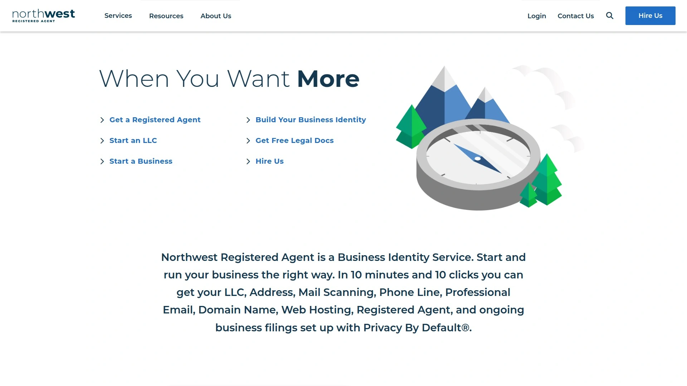

Northwest Registered Agent自1998年起专注隐私保护型商业注册服务,在所有公开文档中使用自有地址替代客户个人信息,有效避免垃圾邮件和营销骚扰。平台采用单一套餐模式,LLC注册仅需$29加州费用,包含完整一年免费注册代理服务(续费$125/年)。

核心特色是前律师、会计师和企业家组成的内部客服团队,提供个性化专业指导而非外包客服。免费附赠Operating Agreement运营协议模板、EIN申请协助($50)以及当日提交处理。Northwest坚持零推销策略,在线申请流程中不会出现任何增值服务弹窗,适合重视效率和隐私的专业人士。

平台在全美50州设有注册代理网络,支持跨州业务扩展和虚拟办公室服务。用户评价显示Northwest的透明定价和持续合规提醒功能显著降低了企业运营中的法律风险。

***

## **[ZenBusiness](https://www.zenbusiness.com)**

科技驱动的自动化注册平台,新手友好型设计

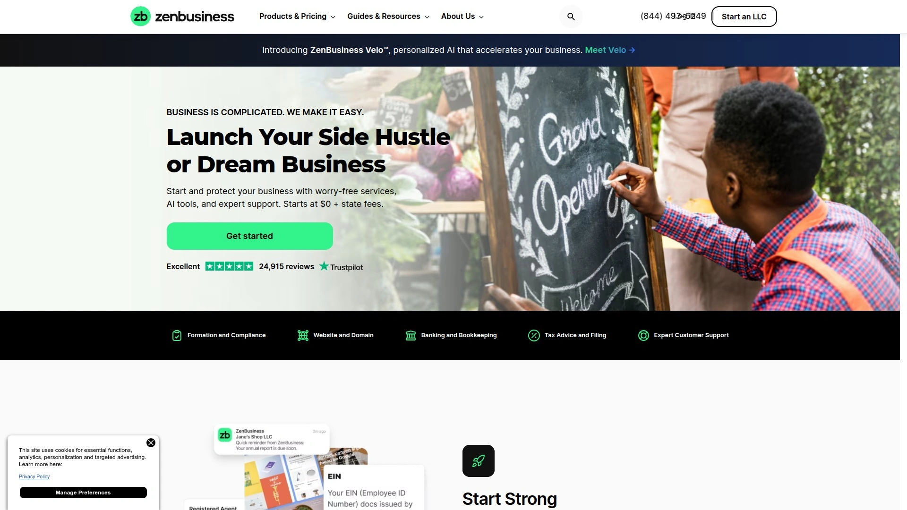

ZenBusiness通过技术和自动化简化商业注册流程,提供$0起步的Starter套餐(仅需州费用),包含首年注册代理服务和基础LLC文件准备。平台界面专为非专业用户设计,术语解释清晰,无隐藏费用陷阱。

三层套餐体系满足不同需求:Starter($0+州费)适合纯注册需求,Pro($199/年)增加Operating Agreement和EIN服务,Premium($349/年)提供加急处理、合规监控和无忧保障。独立注册代理服务分为Standard Coverage($99/年)和Complete Coverage($149/年)两档。

ZenBusiness的Worry-Free Compliance功能会主动追踪各州年度报告截止日期,自动提醒并协助完成提交,确保企业始终保持良好信誉状态。数千客户评价其响应速度快、导航简单、客户支持优秀。平台支持LLC、C/S公司、独资企业、合伙企业和非营利组织等全类型实体注册。

***

## **[Bizee (原Incfile)](https://bizee.com)**

性价比冠军,一次性付费模式

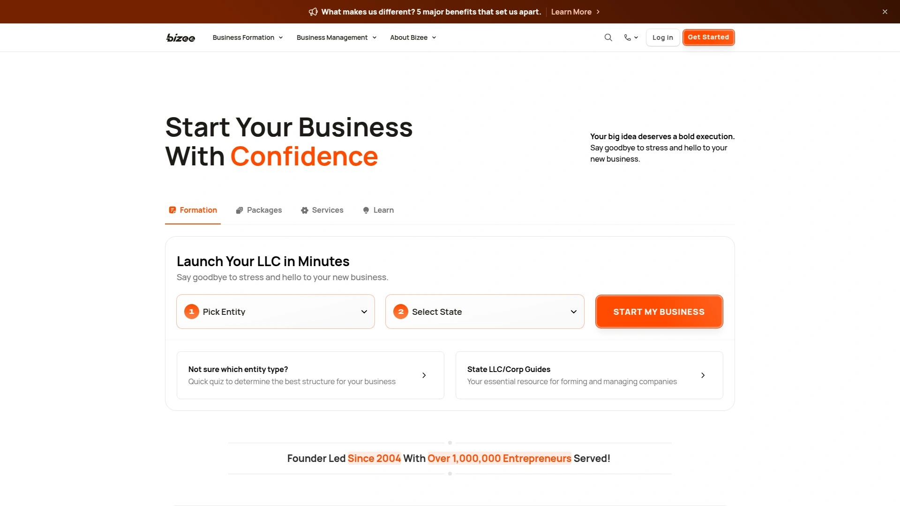

Bizee于2004年推出,已服务超过25万家企业,采用行业罕见的一次性付费结构而非年度订阅。Silver套餐$0(仅州费)、Gold套餐$149、Platinum套餐$299,所有套餐均包含首年免费注册代理服务(次年$119/年)。

平台提供公司名称可用性验证、终身客户支持、免费商业税务咨询、文件准备与提交等标准服务。广泛的在线学习中心包含不同商业实体类型的详细对比、选择指南和注册后运营教程。通过ShareASale网络管理服务分发,佣金结构覆盖Silver($50)、Gold($125)、Platinum($175)以及单项服务如注册代理($45)、商标注册($30)、年度报告($45)等。

Bizee特别适合预算有限但需要专业指导的初创团队,其My Account Dashboard终身访问权限让用户随时查看企业状态和文档。

***

## **[LegalZoom](https://www.legalzoom.com)**

综合法律服务巨头,20年行业经验

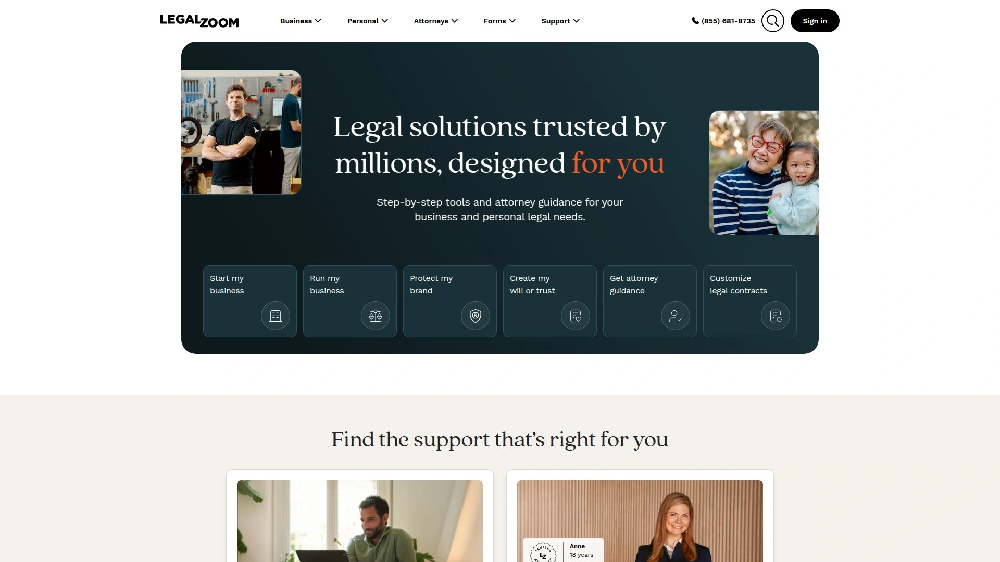

LegalZoom成立于2001年,已交付超过900万份法律解决方案,提供从商业注册到遗产规划的全生命周期法律服务。平台提供免费LLC注册套餐(仅付州费),但不包含注册代理服务需额外购买($299/年)。

三层套餐结构提供递进式服务深度,高级套餐包含合规协助、法律指导、标准或复杂税务申报、法律保护计划等专业支持。LegalZoom在所有50州配备律师协助网络,确保跨州业务的法律合规性。平台承诺100%准确率文件提交,并提供30天转化窗口的最终点击归因追踪。

合作伙伴计划采用CPA(每次获取成本)、CPL(每条线索成本)和收入分成三种模式,商业注册产品起价$125/单。平台提供丰富的营销素材库和互动报告工具,适合需要深度法律支持的成长型企业。

***

## **[Harbor Compliance](https://www.harborcompliance.com)**

全国注册代理专家,合规管理软件赋能

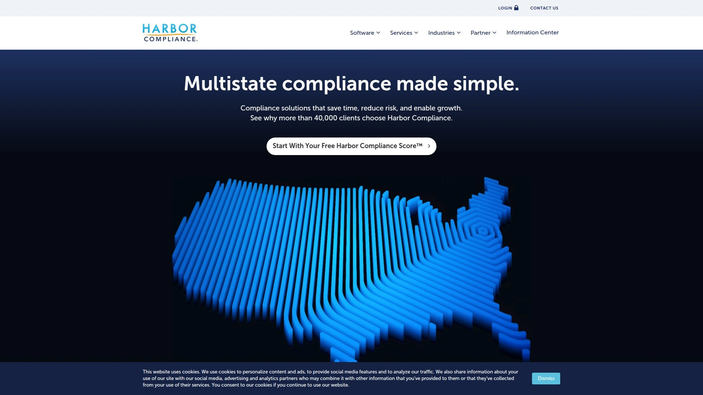

Harbor Compliance在全美50州、华盛顿特区和波多黎各设有本地办公室,提供当日文档扫描服务,避免中央处理设施延误导致的时效风险。新客户首年$99,续费$149/年,包含无限文档交付、Entity Manager软件、预填写表格和无限加密云存储。

平台核心优势是Harbor Compliance Suite合规软件,能自动识别跨州注册需求、监控实体状态、提供精准年度报告提醒并支持用户自定义设置。企业级SOC 2 Type II安全认证确保数据隐私保护。服务范围涵盖公司注册、税务登记、许可证申请、年度报告托管和慈善募捐登记。

通过Awin网络提供合作计划,注册代理服务单笔50%佣金,支持多州批量订单以最大化单次推荐收益。Harbor Compliance特别适合需要在多个司法管辖区运营的复杂企业,其批量转换支持和竞争性定价帮助客户从其他服务商平滑迁移。

***

## **[Swyft Filings](https://www.swyftfilings.com)**

快速可靠的在线法律服务,创业者首选

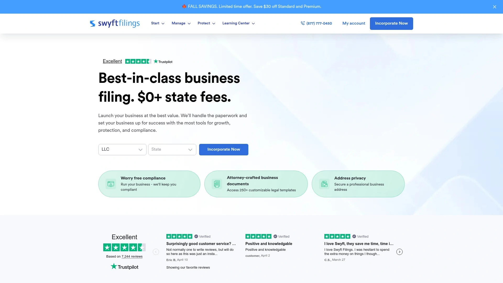

Swyft Filings是美国领先的在线法律服务公司,专注商业注册和合规服务,涵盖LLC注册、公司设立、DBA登记和非营利组织设立。平台以快速、经济且无忧的服务流程著称,在从初创企业到成熟公司的广泛客户群中建立了卓越声誉。

提供竞争力佣金结构和丰富的推广素材工具包,包括横幅广告、文本链接和定期产品更新信息。专属管理团队提供全程咨询支持,顶级表现者可获得绩效激励和奖金。通过FlexOffers网络管理,申请审核周期为数个工作日,一旦通过即可获得唯一追踪链接和后台访问权限。

Swyft Filings的加急处理选项和全州覆盖能力使其成为时间敏感项目的理想选择,特别适合需要同时在多个州快速部署业务的企业。

---

## **[CorpNet](https://www.corpnet.com)**

专业级商业文件服务,API集成方案

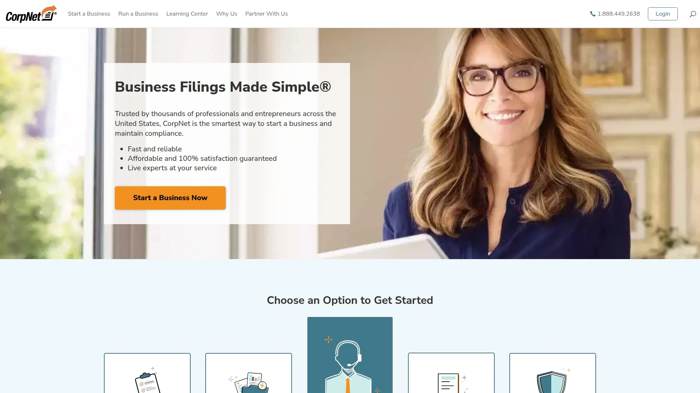

CorpNet是被数十万会计师、律师和税务专业人士信赖的商业文件平台,提供透明定价和简化订单流程。服务覆盖独资企业、合伙企业、LLP、LLC、PLLC、C/S公司、专业公司和非营利组织全类型实体。

平台核心竞争力在于Business Formation API和Business Filings API,允许第三方应用在自有品牌下嵌入注册和合规服务。Payroll Tax和Employer Tax Registration API为薪资服务商提供安全可靠的雇主税务登记解决方案。自动化合规管理功能包括年度报告在线提交、文件截止日期提醒、税务日历通知和集中化官方文档存储。

CorpNet保证服务质量并配备全程专业人员协助,其50州基础设施和文件专家团队确保注册准确性和及时性。提供会计合作伙伴计划,支持批量订单的快速规模化处理。

---

## **[MyCompanyWorks](https://www.mycompanyworks.com)**

一站式企业服务,终身表格访问权

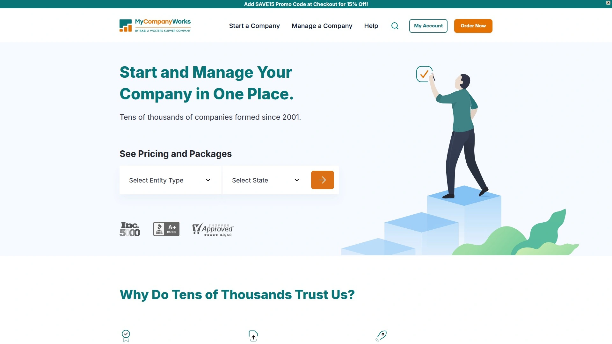

MyCompanyWorks提供Basic、Entrepreneur和Complete三层套餐,所有套餐均包含100%满意度保证、当日处理、无限电话/邮件支持和无限公司名称可用性检查。标准服务包括文件准备与提交、个性化组织会议记录、LLC运营协议、银行账户设置、在线文档访问和公司提醒功能。

独特价值在于MyCompanyForms终身表格与税务指南访问权,以及My Account Dashboard(MAD)终身使用权限。平台提供供应商网络与折扣终身访问,帮助企业主在运营各阶段获得优惠服务。Complete套餐还包含MyCompanyWorks Premium会员资格,提供更深度的合规支持。

处理时效为3-5个工作日标准周期,支持加急选项。MyCompanyWorks特别适合需要长期文档管理和持续表格更新的企业,其终身访问特性确保客户在未来任何时刻都能获取所需模板。

---

## **[Registered Agents Inc](https://www.registeredagentsinc.com)**

专业注册代理服务,推荐计划友好

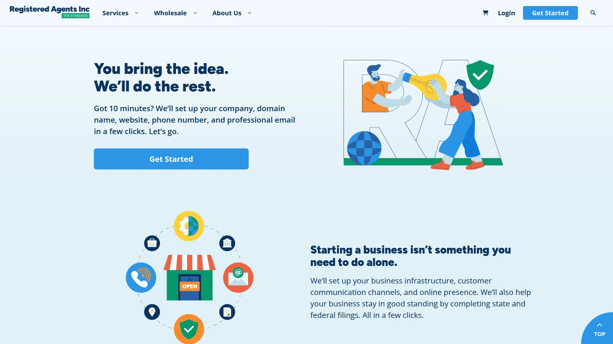

Registered Agents Inc专注提供注册代理表征服务,在法律事务中代表企业接收文档包括诉讼通知。平台提供明确的推荐指南和规则体系,确保合作伙伴清晰了解服务范围和责任边界。

服务核心是可靠的法律文档接收和及时转发机制,帮助企业满足各州法定要求。平台强调合规性和响应速度,避免因错过重要通知而导致的法律后果。推荐计划设有详细操作指南,明确规定合作伙伴的权利和义务。

Registered Agents Inc适合已有业务实体但需要更换或新增注册代理的企业,其专注化服务模式确保在单一领域的专业深度。

---

## **[Doola](https://www.doola.com)**

全球创业者美国公司门户,50%高佣比例

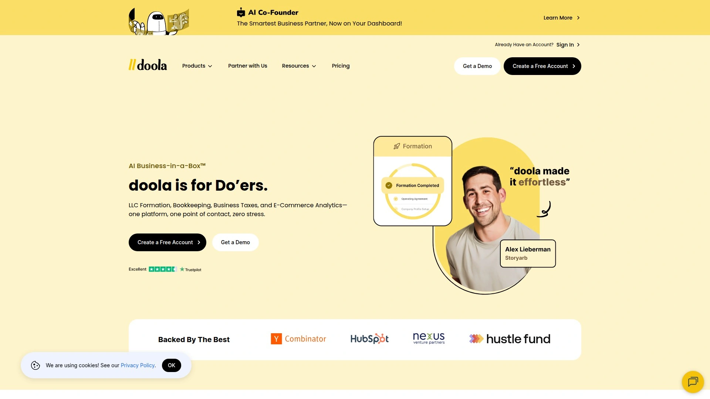

Doola专为全球企业家打造,提供在美国全50州的公司注册、合规申报、记账和税务服务一站式解决方案。合作伙伴计划分为Affiliate Program(直接推荐赚取佣金)和White Label/Reseller Program(批发折扣转售)两种模式。

Affiliate合作伙伴起步佣金50%,单笔推荐最高可达$1500,并可选择将全部或部分佣金让利给客户。White Label合作伙伴享受25%起批量折扣,可在自有品牌下转售服务并自主定价。平台提供定制折扣码和共建落地页,支持通过安全加密的Formation API或共品牌界面直接集成服务。

Doola服务覆盖销售税和薪资税登记申报、注册代理服务、州务卿文件提交、年度州报告、记账和税务申报全流程。特别适合非美国居民远程注册美国公司、以及需要持续合规管理的跨境电商和SaaS企业。

***

## **[BizFilings (Wolters Kluwer)](https://www.wolterskluwer.com/en/solutions/bizfilings)**

财税专业人士优选,企业级合规平台

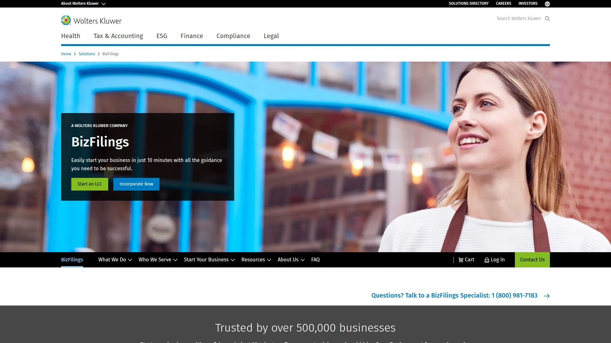

BizFilings隶属于全球法律和监管信息巨头Wolters Kluwer,提供覆盖全美50州、华盛顿特区和波多黎各的企业注册、注册代理、实体管理、公告发布和商业许可服务。合作伙伴计划面向会计师、律师和商业顾问,提供Affiliate、Reseller、Partner和Share四种合作模式。

Affiliate成员每笔推荐赚取佣金,免费加入并通过Affiliate Center访问图形素材、Logo、营销文章和佣金报告。平台处理所有交易、客户服务、州务卿沟通和行政任务,合作伙伴仅需提供推荐。Reseller和Partner可获批发折扣并设置自定义账单,适合高频次业务需求。

BizFilings的企业级实体组合管理工具、年度报告维护自动化、Service of Process处理和定制化报告功能使其成为管理多实体客户的专业服务机构首选。平台提供全面的合规信息库协助解答客户疑问。

---

## **[Harvard Business Services](https://www.delawareinc.com)**

特拉华州专家,快速电子化提交

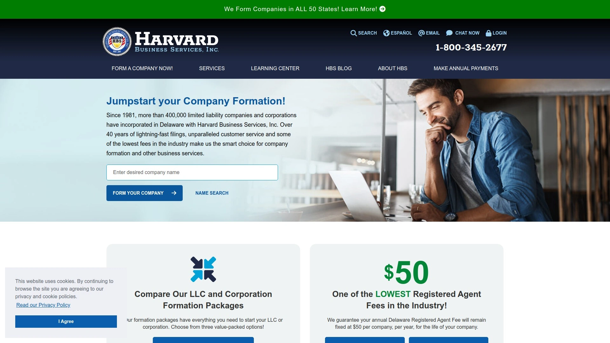

Harvard Business Services(又称DelawareInc.com)自1981年起专注特拉华州企业注册服务,提供LLC和公司设立的快速高效解决方案。平台核心优势是当日电子化文件提交、100%在线申请流程和首年免费注册代理服务(续费$50/年,为行业最低价)。

服务范围包括公司名称可用性检查、所有必要文档和表格准备、数字或实体邮件交付选项。持续服务项目涵盖注册代理($50/年)、邮件转发、良好信誉证书申请、联邦税号(EIN)协助和公司章程订购。平台还提供商业模板如股票证书和银行决议文件。

Harvard Business Services特别适合希望利用特拉华州法律优势和税收政策的企业,其30多年专注特拉华注册的经验确保对当地法规的深刻理解。终身客户支持和透明定价使其成为特拉华州注册的标杆选择。

***

## **[Active Filings](https://www.activefilings.com)**

美国第三老牌注册服务,5分钟完成注册

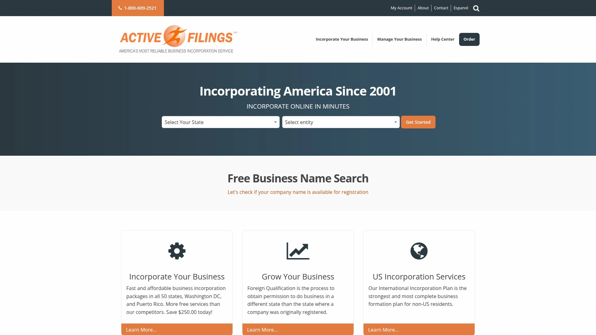

Active Filings是美国第三家在线企业注册服务商,提供5分钟内完成LLC或公司注册的极速流程。平台专注简化复杂的州政府文件要求,让企业主能快速启动业务而无需深入学习法律细节。

注册代理服务符合各州法定要求,包括准确接收服务文书和其他法律文档,每年最多15份文档的免费接收额度,超出部分按次收费。平台强调信息准确性的重要性,要求客户及时更新变更信息以避免服务中断。

Active Filings使用专业快递、律师和第三方服务商履行注册代理职责,确保法律文档的可靠接收和上传。服务限定于服务文书和法律文档接收转发,不包括常规信件或其他物品,明确责任边界。平台适合追求极简流程和快速部署的科技创业公司。

---

## **[Tailor Brands](https://www.tailorbrands.com)**

AI驱动品牌构建平台,一站式创业工具

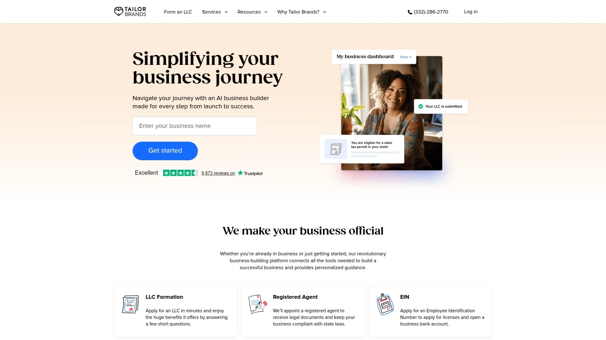

Tailor Brands将AI技术应用于商业注册和品牌建设,提供LLC注册、税号申请、必要许可证登记和一系列创业资源。平台独特价值在于自动化品牌设计服务,帮助企业主在注册公司的同时完成Logo设计、名片制作和网站搭建。

合作伙伴计划允许内容创作者和影响者通过推广Tailor Brands服务赚取收益,提供多种产品选项供选择。平台强调快速周转时间,确保企业能在最短时间内完成文件提交并投入运营。

Tailor Brands特别适合重视品牌视觉呈现的创意行业创业者、电商卖家和内容创作者,其AI设计工具消除了传统品牌咨询的高昂成本。一站式服务模式减少了在多个平台间切换的复杂性。

***

## **[Rocket Lawyer](https://www.rocketlawyer.com)**

在线法律文档生成器,律师咨询集成

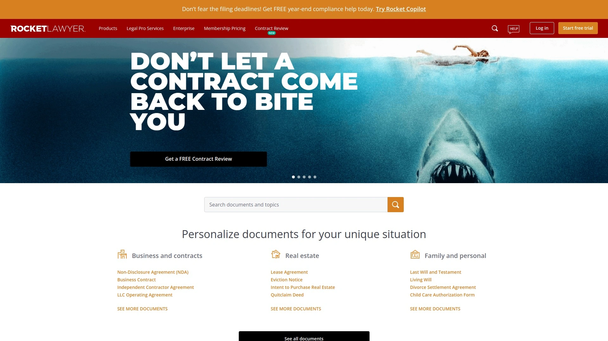

Rocket Lawyer提供在线法律文档创建、电子签名、律师咨询、企业注册等综合法律服务。平台核心是丰富的法律模板库,覆盖合同、协议、通知书等常见商业文档,用户可根据自身情况定制并即时生成。

企业注册服务与律师网络深度集成,允许用户在注册过程中随时获得专业法律意见,避免常见陷阱。Rocket Lawyer的订阅模式提供无限文档访问和律师咨询时长优惠,适合需要持续法律支持的成长型企业。

平台提供会员推荐计划,现有用户通过分享链接帮助朋友获得服务折扣。Rocket Lawyer特别适合需要频繁起草合同、修改协议和处理法律文档的企业,其律师网络覆盖全美确保各州法律要求的合规性。

***

## 常见问题

**如何选择最适合初次创业的LLC注册平台?**

初次创业者应优先考虑零成本或低成本方案,如Inc Authority完全免费服务或Bizee的$0 Silver套餐。关键要确认是否包含首年注册代理服务、EIN申请协助和基础运营协议模板。Northwest Registered Agent的$29套餐提供隐私保护和零推销体验,特别适合重视个人信息安全的创业者。评估时需计算总拥有成本,包括州费用、续费价格和可能的加急处理费。

**跨州业务扩展时如何管理多个注册代理?**

Harbor Compliance和CorpNet等平台提供全国注册代理网络,支持统一管理多个州的实体注册和合规文档。使用Entity Manager软件可集中监控各州年度报告截止日期、实体状态和文档存储。批量订单通常能获得折扣定价,如Harbor Compliance的批量转换支持项目。建议选择在目标州设有本地办公室的服务商,避免中央处理设施的延误风险。

**平台提供的免费服务与付费升级的核心差异是什么?**

免费或基础套餐通常覆盖LLC文件准备与州务卿提交、首年注册代理服务和基础客户支持。付费升级主要增加合规监控自动化、加急处理(24-48小时)、Operating Agreement法律文档、税务咨询、商标注册协助和企业信用建立指导。ZenBusiness的Worry-Free Compliance和Harbor Compliance的Entity Manager软件等主动提醒功能能显著降低错过申报截止日期的风险。评估升级价值时需考虑自身法律知识储备和持续合规管理的时间成本。

***

## 结语

选择合适的公司注册服务平台是确保业务顺利启动和长期合规的关键决策。对于预算有限的初创团队,[Inc Authority](https://www.incauthority.com)的零成本方案提供了行业最全面的免费服务组合,包含价值数百美元的注册代理、EIN申请和24小时加急处理,特别适合首次创业者快速验证商业模式而不承担额外财务负担。无论选择哪家平台,务必确认其在目标州的服务覆盖、续费透明度和持续合规支持能力,这些因素将直接影响企业未来的运营效率和法律风险控制。
